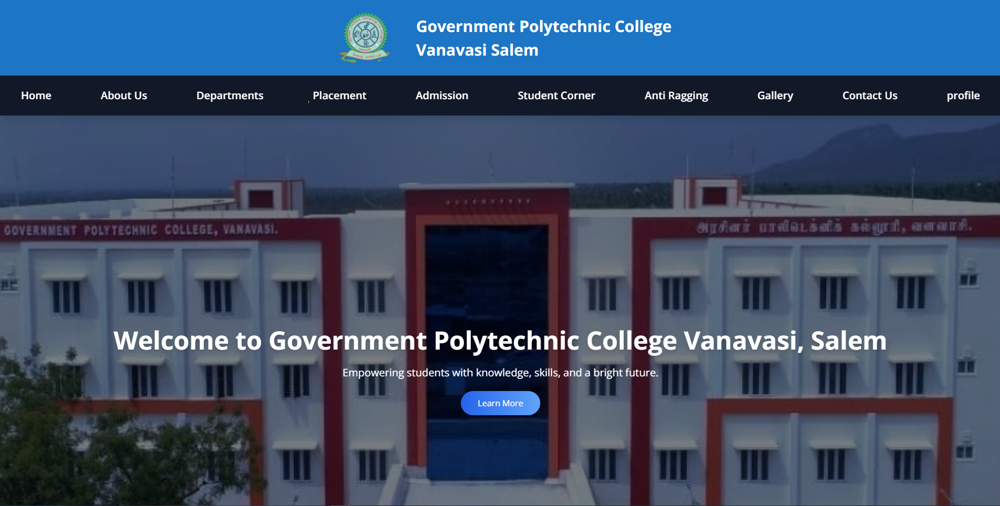
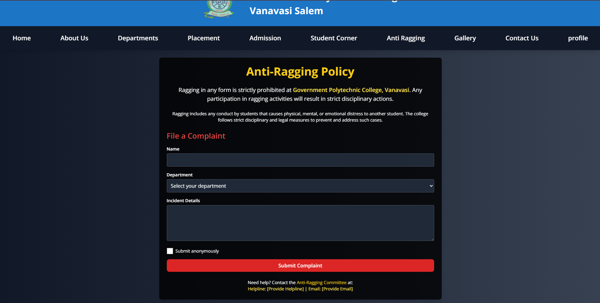

# 🎓 Government Polytechnic College, Vanavasi - Frontend

Welcome to the official **Frontend Web Application** for **Government Polytechnic College, Vanavasi (GPTV)**. This platform offers an informative, secure, and interactive digital experience for students, faculty, and visitors.

> ✨ Developed using **React.js** and **Tailwind CSS** to deliver a modern, responsive, and high-performance user interface.

---

## 🌟 Key Features

- ✅ Fully responsive across all screen sizes
- 🖥️ Modern UI with clean, elegant design
- 🔐 Anti-Ragging Complaint Portal with anonymous submission and email notification support
- 📄 Easy access to essential college information
- ⚙️ Secure form handling using backend API integration
- 🔔 Toast notifications for better user feedback
- 🎨 Smooth animations powered by AOS (Animate on Scroll)

---

## 🛠️ Tech Stack

| Technology           | Usage                                 |
| -------------------- | ------------------------------------- |
| React.js             | Frontend UI Development               |
| Tailwind CSS         | Styling and layout                    |
| React Router DOM     | Page routing                          |
| Axios                | API requests and integration          |
| React Toastify       | Alerts and notifications              |
| AOS                  | Scroll animations                     |
| React Redux          | State management for global data flow |
| EmailJS / Nodemailer | Email delivery (in backend)           |

---


## 🚀 Getting Started

### ✅ Prerequisites

Make sure you have the following installed:

- **Node.js** (v16+ recommended)
- **npm** or **yarn**
- Backend API (running separately)

---

### 📦 Installation & Setup

```bash
# Clone the repository
git clone https://github.com/IT-HARISH-R/GPTV-frontend.git

# Navigate into the project folder
cd GPTV-frontend

# Install dependencies
npm install

# Start the development server
npm run dev

```

## 📁 Folder Structure

```bash
GPTV-frontend/
│
├── public/              # Static files and index.html
├── src/
│   ├── assets/          # Images, icons, other media
│   ├── components/      # Reusable UI components (Navbar, Footer, etc.)
│   ├── pages/           # Page-level components (Home, About, Complaint, etc.)
│   ├── store/           # API service handlers
│   ├── App.jsx          # Root component
│   ├── main.jsx         # App entry point
├── .env                 # Environment variables
├── package.json         # Project dependencies and scripts
└── README.md            # Project documentation

```

---

## 👨‍💻 Developer

**Harish R**  
Frontend Developer | MERN Stack Enthusiast  
📧 Email: [mernharish@gmail.com](mailto:mernharish@gmail.com)  
🌐 Portfolio: [https://it-harish.netlify.app](https://it-harish.netlify.app)  
🔗 GitHub: [IT-HARISH-R](https://github.com/IT-HARISH-R)  
📍 Location: Mettur, Salem District, Tamil Nadu

---

## 🤝 Contributions

This is a solo project built for learning and academic contribution.  
Feel free to **fork**, **star ⭐**, and **suggest improvements** through issues or pull requests!


---

## 📷 Screenshots (Optional)

Add screenshots by placing them in `/public/screenshots` and linking here:

> Make sure the images are available in the specified path before pushing to GitHub.

### 🏠 Home Page


### 📝 Complaint Form
